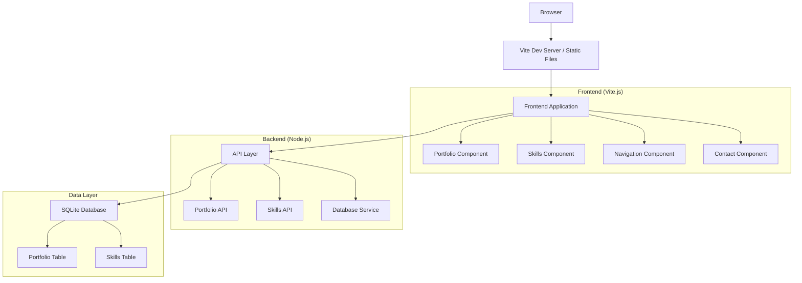

# Design Document

## Overview

This design outlines the migration of a static portfolio website to a modern Vite.js application with SQLite database integration. The migration will transform the current jQuery-based, JSON-file-driven website into a modular, maintainable application while preserving all existing functionality and visual design.

The current website uses:
- Static HTML with Bootstrap CSS framework
- jQuery for DOM manipulation and AJAX calls
- JSON files for data storage (portfolio.json, skill.json)
- Google Maps API integration
- Font Awesome icons and Google Fonts

The new architecture will use:
- Vite.js as the build tool and development server
- Modern JavaScript (ES6+) modules
- SQLite database for data persistence
- Node.js backend for API endpoints
- Tailwind CSS for modern utility-first styling
- pnpm for package management

## Architecture

### High-Level Architecture



### Technology Stack

**Frontend:**
- Vite.js (build tool and dev server)
- Vanilla JavaScript (ES6+ modules)
- Tailwind CSS (utility-first CSS framework)
- Font Awesome (icons)
- Google Fonts (typography)

**Backend:**
- Node.js (runtime)
- Express.js (web framework)
- SQLite3 (database)
- better-sqlite3 (database driver)

**Development Tools:**
- pnpm (package manager)
- ESLint (code linting)
- Prettier (code formatting)
- Vite plugins for asset optimization
- Tailwind CSS plugins

## Components and Interfaces

### Frontend Components

#### 1. Portfolio Component (`src/components/Portfolio.js`)
**Responsibilities:**
- Fetch portfolio data from API
- Render portfolio grid with filtering
- Handle modal interactions for portfolio details
- Manage filter button states

**Interface:**
```javascript
class Portfolio {
  constructor(apiClient)
  async loadPortfolioData()
  renderPortfolioGrid(portfolioItems)
  setupFilterButtons()
  showPortfolioModal(portfolioItem)
}
```

#### 2. Skills Component (`src/components/Skills.js`)
**Responsibilities:**
- Fetch skills data from API
- Render skill bars by category
- Animate progress bars on hover
- Handle skill categorization

**Interface:**
```javascript
class Skills {
  constructor(apiClient)
  async loadSkillsData()
  renderSkillsByCategory(skills)
  animateProgressBars()
  generateSkillBar(skill)
}
```

#### 3. Navigation Component (`src/components/Navigation.js`)
**Responsibilities:**
- Handle smooth scrolling navigation
- Manage mobile menu toggle
- Update active navigation states

#### 4. API Client (`src/services/ApiClient.js`)
**Responsibilities:**
- Centralized API communication
- Error handling for API requests
- Data transformation and caching

**Interface:**
```javascript
class ApiClient {
  async getPortfolioItems(filters = {})
  async getSkills(category = null)
  handleApiError(error)
}
```

### Backend API Endpoints

#### Portfolio API (`/api/portfolio`)
- `GET /api/portfolio` - Get all portfolio items
- `GET /api/portfolio?category={category}` - Get filtered portfolio items
- `GET /api/portfolio/{id}` - Get specific portfolio item

#### Skills API (`/api/skills`)
- `GET /api/skills` - Get all skills
- `GET /api/skills?category={category}` - Get skills by category

### Database Service (`src/services/DatabaseService.js`)
**Responsibilities:**
- Database connection management
- CRUD operations for portfolio and skills
- Data migration from JSON files
- Query optimization and error handling

## Data Models

### Portfolio Table Schema
```sql
CREATE TABLE portfolio (
  id INTEGER PRIMARY KEY AUTOINCREMENT,
  name TEXT NOT NULL,
  img TEXT NOT NULL,
  site TEXT,
  date TEXT NOT NULL,
  category TEXT NOT NULL,
  description TEXT,
  created_at DATETIME DEFAULT CURRENT_TIMESTAMP,
  updated_at DATETIME DEFAULT CURRENT_TIMESTAMP
);

CREATE INDEX idx_portfolio_category ON portfolio(category);
CREATE INDEX idx_portfolio_date ON portfolio(date);
```

### Skills Table Schema
```sql
CREATE TABLE skills (
  id INTEGER PRIMARY KEY AUTOINCREMENT,
  name TEXT NOT NULL,
  power INTEGER NOT NULL CHECK(power >= 0 AND power <= 100),
  category TEXT NOT NULL,
  created_at DATETIME DEFAULT CURRENT_TIMESTAMP,
  updated_at DATETIME DEFAULT CURRENT_TIMESTAMP
);

CREATE INDEX idx_skills_category ON skills(category);
CREATE INDEX idx_skills_power ON skills(power);
```

### Data Migration Strategy
1. Create database tables with proper schema
2. Read existing JSON files (portfolio.json, skill.json)
3. Transform and validate data
4. Insert data into SQLite tables
5. Verify data integrity and completeness

## Error Handling

### Frontend Error Handling
- API request failures with user-friendly messages
- Graceful degradation when data is unavailable
- Loading states and error boundaries
- Retry mechanisms for failed requests

### Backend Error Handling
- Database connection error handling
- Input validation and sanitization
- Proper HTTP status codes
- Structured error responses
- Logging for debugging and monitoring

### Database Error Handling
- Connection pool management
- Transaction rollback on failures
- Constraint violation handling
- Data integrity checks

## Testing Strategy

### Unit Testing
- Component functionality testing
- API endpoint testing
- Database service testing
- Utility function testing

### Integration Testing
- Frontend-backend API integration
- Database migration testing
- End-to-end user workflows
- Cross-browser compatibility testing

### Performance Testing
- Page load time optimization
- Database query performance
- Asset loading and caching
- Mobile device performance

### Testing Tools
- Jest (unit testing framework)
- Cypress (end-to-end testing)
- Lighthouse (performance auditing)
- Browser testing across Chrome, Firefox, Safari

## Build and Deployment Configuration

### Vite Configuration (`vite.config.js`)
```javascript
export default {
  build: {
    outDir: 'dist',
    assetsDir: 'assets',
    rollupOptions: {
      output: {
        manualChunks: {
          vendor: ['font-awesome']
        }
      }
    }
  },
  server: {
    proxy: {
      '/api': 'http://localhost:3000'
    }
  }
}
```

### Development Workflow
1. Run `pnpm dev` for development server with HMR
2. Backend API server runs on port 3000
3. Frontend dev server runs on port 5173 with API proxy
4. Database file stored in `data/portfolio.db`
5. Tailwind CSS watches for class changes and rebuilds styles

### Production Build
1. `pnpm build` generates optimized static assets
2. Express server serves both API and static files
3. SQLite database deployed with application
4. Tailwind CSS purges unused styles for optimal bundle size
5. Asset optimization and compression enabled